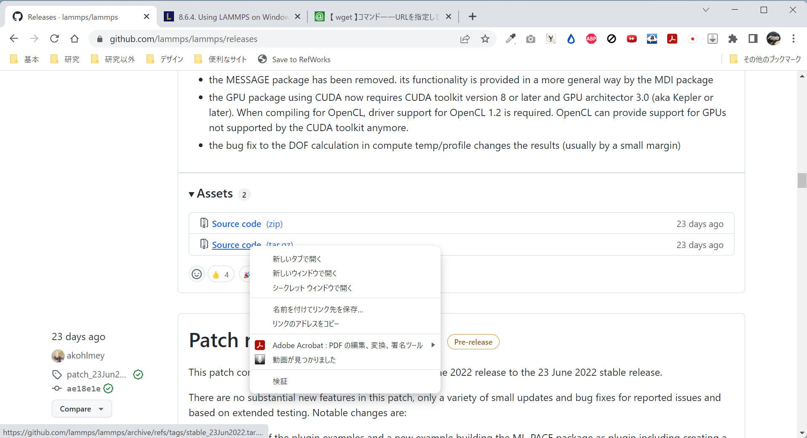

# 目次 (2022年8月12日時点)
- [目次 (2022年8月12日時点)](#目次-2022年8月12日時点)
- [はじめに](#はじめに)
- [WSL2とLAMMPSのセットアップ](#wsl2とlammpsのセットアップ)
  - [WSL2のインストール](#wsl2のインストール)
  - [LAMMPSのダウンロード](#lammpsのダウンロード)
    - [FFMPEGのインストール](#ffmpegのインストール)
  - [LAMMPSのビルド](#lammpsのビルド)
  - [(任意)cudaのインストール](#任意cudaのインストール)
    - [CUDA Toolkitのインストール](#cuda-toolkitのインストール)
  - [LAMMPSのインストール](#lammpsのインストール)
- [VSCodeでコードを書く](#vscodeでコードを書く)
- [解析実行](#解析実行)
- [結果の可視化](#結果の可視化)

# はじめに
これはDEM(個別要素法, Discrete Element Model)のシミュレーションに用いられるLAMPPSというプログラムのチュートリアル用資料です。
DEMは粒状体である地盤材料と相性が良く、様々の解析で使用されるようになってきています。
中でもLAMPPSは化学の古典分子動力学の分野で古くから使われてきた実績があり、多くの論文でも解析プログラムとして用いられています。

ただ、文字入力をベースとする解析プログラムであるため、マウスやアイコンといったGUI(Graphical User Interface)に慣れている人には少し使いにくいものかもしれません。
この資料ではそうした人向けに、なるべく分かりやすく手順を解説できればと考えています。もし質問や誤字脱字等ありましたら遠慮なく聞いてください。

基本的な解析の流れは以下の通りです。1は最初だけ、2~4を繰り返してやっていく形になります。

1. [WSL2とLAMMPSのセットアップ](#WSL2とLAMMPSのセットアップ)
2. [VSCodeでコードを書く](#VSCodeでコードを書く)
3. [解析実行](#解析実行)
4. [結果の可視化](#結果の可視化)

基本的にこの資料は公式の[Document](https://docs.lammps.org/Manual.html)を参考にして作成しています。
英語で書かれていますが、内容はとんでもない充実度ですので、読んでも良く分からない場合にはそちらも参考にしてみてください。

# WSL2とLAMMPSのセットアップ

WSL2(Windows Subsystem for Linux 2)というのは、WindowsのOS上にLinuxという別のOSを作ることができる機能です。

LAMPPSはLinuxベースで開発が進められているので、解析を始めるにはまずLinuxの環境を作る必要があります。
Linuxの環境を作るには現在大きく分けて二つの方法があります。

1. Linuxがインストールされたノートパソコンorデスクトップパソコンを準備する
2. WSL2によってWindows上にLinuxのOSを作ってしまう

1は2ほどめんどくさい事前準備が必要ないのですが、持つべき端末が1台増えてしまいます。そのため今回は2の方法で進めたいと考えています。

## WSL2のインストール

今回参考したのはMicrosoftの[公式ドキュメント](https://docs.microsoft.com/ja-jp/windows/wsl/install)です。
まず皆さんのノートパソコンあるいはデスクトップパソコン上で、デスクトップが開いている状態でWindowsキーを押して`windows terminal`と検索してください。
そうするとmicrosoft storeの画面が出てくると思いますので、windows terminalをインストールしてください。

インストール後もう一度windowsキーを押して、`windows terminal`と入力して**右クリックして管理者権限を与えて**windows terminalを起動してください。
そうするとWindows Powershellと左上に書かれた画面が表示されると思います。

 

そうしたら`>`の横に続けて以下のコマンドを入力して、`enter`を押してください。
```bash
wsl --install
```
こののち、色々な文字が表れると思います。最後に`要求された操作は正常に終了しました。変更を有効にするには、システムを再起動する必要があります`という文が出ますので、PCを再起動しましょう。


***

<details>
<summary>
Ubuntuがインストールされずにwslコマンドのガイドが表示された場合
</summary>

```bash
wsl --list --online
```

を実行したのちに、一番下に出てくる`Ubuntu-20.04`(時期によって異なります)を使って

```bash
wsl --install -d Ubuntu-20.04
```

のコマンドを実行してください。

</details>

<details>
<summary>
「ファイル システムの 1 つをマウント中にエラーが発生しました」というエラーが表示される場合
</summary>

`ファイル システムの 1 つをマウント中にエラーが発生しました。詳細については、「dmesg」を実行してください。`というコメントが出た場合には、ユーザー名とパスワードの入力後に一旦画面を閉じて、管理者権限で起動したWindows Terminalの欄に次の2つのコマンドを一つずつ入力してください。

```bash
wsl.exe --update
wsl.exe --shutdown
```
この状態でも`ファイル システム~`のメッセージが出る場合には、`dmesg | grep -i error`のコマンドを打った後の結果を見せてください。
</details>

***

再起動すると英語でユーザー名とパスワードを聞いてくる画面が自動で出てきます。ユーザー名は個人が特定されにくいものがいいでしょう。
パスワードは入力しても何も画面には反映されませんが仕様です。再入力も同じものを入力しましょう。

これらの作業が終了したらWindows Terminalを開いた直後の状態から、上のタブの下矢印(v)をクリックしてください。そして`Ubuntu`あるいは`Ubuntu 22.04 LTS`をクリックしてください。


 

これが終わったら次のような画面が表示されていると思います。

 

このUbuntu画面では`$`の後にコマンドという指令を出していくことで、データの操作を行っていきます。まず、Ubuntuの中身をアップデートする必要があるので次のコマンドを`$`の後に続けて打ち、一つずつ実行してください。 なおここからは基本的に[LAMMPSの公式サイト](https://docs.lammps.org/Howto_wsl.html)を参考にしていきます。

```bash
sudo apt update
sudo apt upgrade -y
```

続けてLAMMPSの実行に必要なパッケージをインストールしていきます。次のコマンドを打って実行してください。

```bash
sudo apt install -y cmake build-essential ccache gfortran openmpi-bin libopenmpi-dev libfftw3-dev libjpeg-dev libpng-dev python3-dev python3-pip python3-virtualenv libblas-dev liblapack-dev libhdf5-serial-dev hdf5-tools clang-format
```

## LAMMPSのダウンロード

次に行うのはLAMMPSのダウンロードです。公式HPには二つの方法がありますが、現時点(2022年7月16日)での最新版が`stable_23June2022`なので、このidと方法1でダウンロードしていきます。最新版のリリースは[こちら](https://github.com/lammps/lammps/releases)から確認できます。次のコマンドで使用するURLは各投稿の一番下にあるAssetsから右クリックすることで取得できます。

 

まず最初に`wget`コマンドを使用してファイルをダウンロードします。
```bash
wget https://github.com/lammps/lammps/archive/refs/tags/stable_23Jun2022.tar.gz
```

次に`tar`コマンドを使用して解凍します。
```bash
tar xvzf stable_23Jun2022.tar.gz
```

そして解凍してできたフォルダに移動します。
```bash
cd lammps-stable_23Jun2022
```

### FFMPEGのインストール

また次のコンパイル時にエラーが出ないようにするためにFFMEPGというパッケージもインストールしておきます。次のコマンドを1行ずつ実行してください。

```bash
sudo add-apt-repository ppa:mc3man/trusty-media
sudo apt-get update
sudo apt-get dist-upgrade
sudo apt-get install ffmpeg
```

## LAMMPSのビルド

次にLAMMPSのビルドを行います。まず今移動してきた`lammps-stable_23Jun2022`のフォルダの中に`build`というフォルダを作り、そちらに移動します。次のコマンドを1行ずつ実行してください。

```bash
mkdir build
cd build
```

ビルドの仕方はたくさんあり、後にも細かい設定を変えていくのですが、ひとまずデフォルトの設定でビルドをしてみたいと思います。`lammps-stable_23Jun2022`の中の`cmake`の中の`presets`というフォルダに、デフォルトのビルド設定が書かれたファイルがありますので、それを取ってきて構成します。これにより構成(Configuration)が終わり、Makefileという中間ファイルが作られます。(←たぶん正確な表現ではないと思われる...)

```bash
cmake ../cmake/presets/basic.cmake ../cmake
```

この後コンパイルをしていきます。
```bash
make -j 4
```
`-j 4`は何個の並列プロセスを走らせるかという意味です。自分のパソコンの物理コアに対応する数を入力するとコンパイルを早く終わらせることが出来ます。`[100%] Built target lmp`と最後に表示されればコンパイルは完成です。これで`build`のフォルダ内に実行可能ファイル`lmp`が作成されました。

## (任意)cudaのインストール
基本的な内容はここまでなのですが、いくつかシミュレーションの高速化に当たって有用なパッケージがあるのでそれをインストールしていきたいと思います。**外付けのGPGPU(NVidia GeforceやAMD Radion)等がPCに付属しており、かつ接触モデルに`gran/hooke/history`を用いる**場合には、KOKKOSというアクセラレータ(加速用)パッケージが使用できます。ここからはこのKOKKOSを使用するための環境構築手順を説明します。

なお今回の環境はGeforce GTX 1060を基準にして話をしていきます。

### CUDA Toolkitのインストール
基本的な流れは[Nvidia公式サイト](https://docs.nvidia.com/cuda/wsl-user-guide/index.html#getting-started-with-cuda-on-wsl)から見れます。しかし手持ちの環境だとうまくいかなかった箇所があったため、こちらにも書いていきたいと思います。

まず行うべきはNvidiaのドライバのダウンロードです。これはwsl上ではなくホストのwindows上で行います。こちらの[リンク](https://www.nvidia.com/Download/index.aspx?lang=en-us)からドライバをダウンロードしてインストールしてください。なお自分のPCのGPGPUについてはタスクマネージャーから確認できます。またwindowsキーを押して、'Nvidia Control Panel`と入力した場合に同じ名前のソフトが出てくるようであれば、この手順は飛ばしてもらって大丈夫です。

次からはWindows Terminal上のUbuntuの操作になります。まず次のコマンドを実行し、一番上の階層に移ります。
```bash
cd ~
```

そして次のコマンドを上から一つずつ実行していってください。4行目のアスタリスクの部分は3行目のコマンドの実行結果に表示される文字列を参考に書き直してください。

```bash
wget https://developer.download.nvidia.com/compute/cuda/repos/wsl-ubuntu/x86_64/cuda-wsl-ubuntu.pin
sudo mv cuda-wsl-ubuntu.pin /etc/apt/preferences.d/cuda-repository-pin-600
wget https://developer.download.nvidia.com/compute/cuda/11.7.1/local_installers/cuda-repo-wsl-ubuntu-11-7-local_11.7.1-1_amd64.deb
sudo dpkg -i cuda-repo-wsl-ubuntu-11-7-local_11.7.1-1_amd64.deb
sudo cp /var/cuda-repo-wsl-ubuntu-11-7-local/cuda-*-keyring.gpg /usr/share/keyrings/
sudo apt-get update
sudo apt-get -y install cuda
```

最後にbin2cというファイルをwsl上のUbuntuに覚えて貰うために以下のコマンドを実行します。(pathへの追加)
```bash
sudo nano ~/.profile
```

そうすると次のような画面が出てくると思います。下矢印キーを押して一番下の行にカーソルを移動して、`PATH=$PATH:/usr/local/cuda-11.7/bin`を新しい行として追加してください。

 

入力が終わったら`ctrl+O`→`enter`→`ctrl+X`を押して、保存し元の画面に戻ってください。その後さらに

```bash
source ~/.profile
```
と先ほど入力したPathが反映される形となります。ここまでやればあともう一息です。

```bash
cd lammps-stable_23Jun2022
rm -r build
mkdir build
cd build
```

と実行して、先ほどのビルドフォルダを一旦削除したのち`build`フォルダに移ります。そしてGPUパッケージ、GRANULARパッケージ、KOKKOSパッケージを有効化するために次のコードを実行し、コンパイルします。**ここで`GPU_ARCH=sm_61, Kokkos_ARCH_SKX=yes, Kokkos_ARCH_PASCAL61`の部分はPCの構成によって変更がある部分です。** [こちら](https://docs.lammps.org/Build_extras.html#available-architecture-settings)を参考に適切な文字列に置き換えてください。

```bash
cmake ../cmake 
cmake -D PKG_GPU=yes -D GPU_API=cuda -D GPU_ARCH=sm_61 -D PKG_GRANULAR=yes -D PKG_KOKKOS=yes -D Kokkos_ARCH_BDW=yes -D Kokkos_ENABLE_OPENMP=yes -D BUILD_OMP=yes -D Kokkos_ARCH_TURING75=yes -D Kokkos_ENABLE_CUDA=yes -D CMAKE_CXX_COMPILER=${HOME}/lammps-stable_23Jun2022/lib/kokkos/bin/nvcc_wrapper . 
```

そしてビルドを実行します。

```bash
make -j 4
```

これで特にエラーが出てこなければひとまずビルドは完成です！

## LAMMPSのインストール
さらに作成した実行可能ファイルをインストールします。

```bash
sudo make install
```

インストール先は`~/.local/bin`となりますので、このパスを追加します。先ほどと同じようにnanoエディタで`.profile`を開きます。

```bash
sudo nano ~/.profile
```

ここの最終行に以下の文字列を追加します。
```bash
PATH=$PATH:$HOME/.local/bin
```
入力が終わったら`ctrl+O`→`enter`→`ctrl+X`を押して、保存し元の画面に戻ってください。その後さらに
```bash
source ~/.profile
```
と先ほど入力した内容が反映されます。このあと`lmp`とコマンドを打つと次のようなログが表示されれば成功です。
```bash
LAMMPS (23 Jun 2022)
OMP_NUM_THREADS environment is not set. Defaulting to 1 thread. (src/comm.cpp:98)
  using 1 OpenMP thread(s) per MPI task
```

# VSCodeでコードを書く
ひとまず2022/6/26時点で動くコードは[こちら](./sample.in)から。

まずコード全体の概観の説明をします。基本的にLAMMPSのコードは設計書だと思ってください。前の節で作成した実行可能ファイル(ゼネコン)にこの設計書を渡すことで、解析(建築作業)が始まります。コードは大きく分けて4つのセクションに分かれます。

1. 初期化：粒子や粒子を入れる箱を作る前のパラメータを決定します(単位、次元、境界条件、解析する粒子の種類など)
2. 系の定義：粒子や粒子を入れる箱、また粒子に作用する力に関する仕様を決定します。
3. 解析の定義：粒子や粒子を入れる箱、また粒子に作用する力に関するパラメータを決定します。
4. 実行：解析を実行します。
   
[サンプルコード](./sample.in)について各行の意味を詳細に書きました。基本的にはこれを改良していくので問題ないかと思います。

# 解析実行
(まだです)
# 結果の可視化
(まだです)