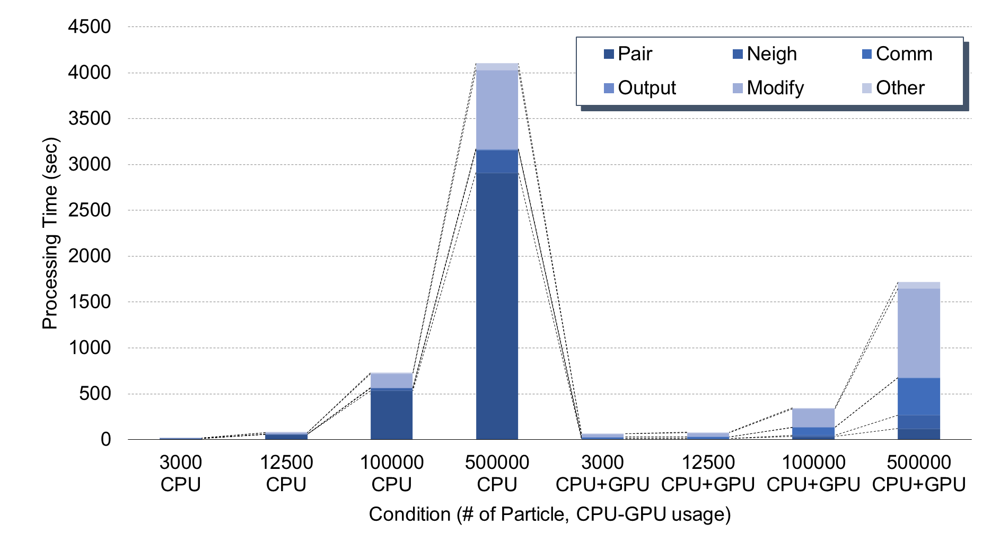

# ベンチマーク結果

## 2022年8月17日分
KOKKOSなし: `../build_raw/lmp -in sample2.in`

KOKKOSあり: `mpirun -np 1 ../build/lmp -k on g 1 -sf kk -pk kokkos neigh half comm no -in sample2.in`

### まとめ
- KOKKOSによる高速化がそれほど大きくない(粒子数数万オーダーからCPU+GPUが速くなるが2倍程度)
- Commに時間がかかるのは、CPUとGPU間の通信の影響によるもの？どのようにPCIe通信量を定量化することが出来る？
- CUDAが最大50%までしか使用されていない
- `kokkos neigh half comm no`を付けなかった場合`ERROR: Must use half neighbor list with gran/hooke/history/kk (src/KOKKOS/pair_gran_hooke_history_kokkos.cpp:92)`というエラーが出る。
  - またこの引数を入れると粒子系全体の周期的な振動が収束しなくなる。
- HWiNFOでGPUの`Performance Limitation - Reliability Voltage`がずっとYesになっている。
- というか`MPIRUN -n 16`にしても全くコアが使用されていない。




### 3000個 3cm KOKKOSなし
```console
Section |  min time  |  avg time  |  max time  |%varavg| %total
---------------------------------------------------------------
Pair    | 12.951     | 12.951     | 12.951     |   0.0 | 71.50
Neigh   | 0.17906    | 0.17906    | 0.17906    |   0.0 |  0.99
Comm    | 0.0085003  | 0.0085003  | 0.0085003  |   0.0 |  0.05
Output  | 0.54386    | 0.54386    | 0.54386    |   0.0 |  3.00
Modify  | 4.296      | 4.296      | 4.296      |   0.0 | 23.72
Other   |            | 0.1344     |            |       |  0.74

Total # of neighbors = 24508
Ave neighs/atom = 8.2103853
Neighbor list builds = 173
Dangerous builds = 0
Total wall time: 0:00:18
```

### 3000個 3cm KOKKOSあり
```console
Section |  min time  |  avg time  |  max time  |%varavg| %total
---------------------------------------------------------------
Pair    | 9.946      | 9.946      | 9.946      |   0.0 | 15.00
Neigh   | 0.27758    | 0.27758    | 0.27758    |   0.0 |  0.42
Comm    | 16.897     | 16.897     | 16.897     |   0.0 | 25.49
Output  | 0.50225    | 0.50225    | 0.50225    |   0.0 |  0.76
Modify  | 34.117     | 34.117     | 34.117     |   0.0 | 51.46
Other   |            | 4.554      |            |       |  6.87

Total # of neighbors = 21424
Ave neighs/atom = 7.2256324
Neighbor list builds = 352
Dangerous builds = 0
Total wall time: 0:01:07
```

### 12500個 2cm KOKKOSなし
```console
Section |  min time  |  avg time  |  max time  |%varavg| %total
---------------------------------------------------------------
Pair    | 57.339     | 57.339     | 57.339     |   0.0 | 74.30
Neigh   | 1.422      | 1.422      | 1.422      |   0.0 |  1.84
Comm    | 0.033539   | 0.033539   | 0.033539   |   0.0 |  0.04
Output  | 0.96323    | 0.96323    | 0.96323    |   0.0 |  1.25
Modify  | 16.809     | 16.809     | 16.809     |   0.0 | 21.78
Other   |            | 0.6071     |            |       |  0.79

Total # of neighbors = 104072
Ave neighs/atom = 8.3800628
Neighbor list builds = 312
Dangerous builds = 0
Total wall time: 0:01:17
```

### 12500個 2cm KOKKOSあり
```console
Section |  min time  |  avg time  |  max time  |%varavg| %total
---------------------------------------------------------------
Pair    | 10.13      | 10.13      | 10.13      |   0.0 | 12.73
Neigh   | 0.75902    | 0.75902    | 0.75902    |   0.0 |  0.95
Comm    | 19.708     | 19.708     | 19.708     |   0.0 | 24.76
Output  | 0.86979    | 0.86979    | 0.86979    |   0.0 |  1.09
Modify  | 44.268     | 44.268     | 44.268     |   0.0 | 55.62
Other   |            | 3.852      |            |       |  4.84

Total # of neighbors = 91608
Ave neighs/atom = 7.3693186
Neighbor list builds = 880
Dangerous builds = 0
Total wall time: 0:01:20
```

### 100000個 1cm KOKKOSなし
```console
Section |  min time  |  avg time  |  max time  |%varavg| %total
---------------------------------------------------------------
Pair    | 534.15     | 534.15     | 534.15     |   0.0 | 73.19
Neigh   | 27.593     | 27.593     | 27.593     |   0.0 |  3.78
Comm    | 0.70002    | 0.70002    | 0.70002    |   0.0 |  0.10
Output  | 2.3024     | 2.3024     | 2.3024     |   0.0 |  0.32
Modify  | 152.45     | 152.45     | 152.45     |   0.0 | 20.89
Other   |            | 12.57      |            |       |  1.72

Total # of neighbors = 746375
Ave neighs/atom = 7.5408933
Neighbor list builds = 723
Dangerous builds = 0
Total wall time: 0:12:09
```

### 100000個 1cm KOKKOSあり
```console
Section |  min time  |  avg time  |  max time  |%varavg| %total
---------------------------------------------------------------
Pair    | 34.601     | 34.601     | 34.601     |   0.0 |  9.98
Neigh   | 13.133     | 13.133     | 13.133     |   0.0 |  3.79
Comm    | 85.914     | 85.914     | 85.914     |   0.0 | 24.78
Output  | 2.0486     | 2.0486     | 2.0486     |   0.0 |  0.59
Modify  | 200.99     | 200.99     | 200.99     |   0.0 | 57.96
Other   |            | 10.07      |            |       |  2.90

Total # of neighbors = 615840
Ave neighs/atom = 6.1737727
Neighbor list builds = 4153
Dangerous builds = 0
Total wall time: 0:05:49
```

### 500000個 0.6cm KOKKOSなし
```console
Section |  min time  |  avg time  |  max time  |%varavg| %total
---------------------------------------------------------------
Pair    | 2912       | 2912       | 2912       |   0.0 | 70.97
Neigh   | 246.28     | 246.28     | 246.28     |   0.0 |  6.00
Comm    | 7.1115     | 7.1115     | 7.1115     |   0.0 |  0.17
Output  | 5.1583     | 5.1583     | 5.1583     |   0.0 |  0.13
Modify  | 861.98     | 861.98     | 861.98     |   0.0 | 21.01
Other   |            | 70.86      |            |       |  1.73

Total # of neighbors = 3686034
Ave neighs/atom = 7.4271028
Neighbor list builds = 1246
Dangerous builds = 75
Total wall time: 1:08:24
```

### 500000個 0.6cm KOKKOSあり
```console
Section |  min time  |  avg time  |  max time  |%varavg| %total
---------------------------------------------------------------
Pair    | 120.18     | 120.18     | 120.18     |   0.0 |  7.00
Neigh   | 146.39     | 146.39     | 146.39     |   0.0 |  8.53
Comm    | 408.26     | 408.26     | 408.26     |   0.0 | 23.78
Output  | 4.4039     | 4.4039     | 4.4039     |   0.0 |  0.26
Modify  | 968.73     | 968.73     | 968.73     |   0.0 | 56.42
Other   |            | 69.04      |            |       |  4.02

Total # of neighbors = 2941284
Ave neighs/atom = 5.8941087
Neighbor list builds = 12934
Dangerous builds = 43
Total wall time: 0:28:44
```


## 2022年7月分

結果のまとめは以下の通り
- CPUのコア数は物理コア数まではほぼ律速
- `comm`にすごく時間がかかる場合がある
  - RyzenだからMCMの関係かも?(←自信はありません...)
- GPUは`PKG_GPU=on`にしてもメモリを使用するだけで全然速くならない
- 
### `100.0% CPU use with 1 MPI tasks x 1 OpenMP threads`

```bash
Section |  min time  |  avg time  |  max time  |%varavg| %total
---------------------------------------------------------------
Pair    | 4.4758     | 4.4758     | 4.4758     |   0.0 | 73.16
Neigh   | 0.8622     | 0.8622     | 0.8622     |   0.0 | 14.09
Comm    | 0.032106   | 0.032106   | 0.032106   |   0.0 |  0.52
Output  | 0.0011555  | 0.0011555  | 0.0011555  |   0.0 |  0.02
Modify  | 0.7174     | 0.7174     | 0.7174     |   0.0 | 11.73
Other   |            | 0.02894    |            |       |  0.47

Nlocal:           3000 ave        3000 max        3000 min
Histogram: 1 0 0 0 0 0 0 0 0 0
Nghost:            458 ave         458 max         458 min
Histogram: 1 0 0 0 0 0 0 0 0 0
Neighs:          16800 ave       16800 max       16800 min
Histogram: 1 0 0 0 0 0 0 0 0 0

Total # of neighbors = 16800
Ave neighs/atom = 5.6
Neighbor list builds = 1168
Dangerous builds = 0
Total wall time: 0:00:06
```

### `100.0% CPU use with 2 MPI tasks x 1 OpenMP threads`

```bash
MPI task timing breakdown:
Section |  min time  |  avg time  |  max time  |%varavg| %total
---------------------------------------------------------------
Pair    | 1.0778     | 2.2797     | 3.4817     |  79.6 | 48.86
Neigh   | 0.33048    | 0.43536    | 0.54025    |  15.9 |  9.33
Comm    | 0.074782   | 1.4048     | 2.7348     | 112.2 | 30.11
Output  | 0.00052933 | 0.00078022 | 0.0010311  |   0.0 |  0.02
Modify  | 0.47923    | 0.51266    | 0.5461     |   4.7 | 10.99
Other   |            | 0.03222    |            |       |  0.69

Nlocal:           1500 ave        2037 max         963 min
Histogram: 1 0 0 0 0 0 0 0 0 1
Nghost:          461.5 ave         481 max         442 min
Histogram: 1 0 0 0 0 0 0 0 0 1
Neighs:           8459 ave       12697 max        4221 min
Histogram: 1 0 0 0 0 0 0 0 0 1

Total # of neighbors = 16918
Ave neighs/atom = 5.6393333
Neighbor list builds = 1170
Dangerous builds = 0
Total wall time: 0:00:04
```

### `98.9% CPU use with 4 MPI tasks x 1 OpenMP threads`

```bash
Section |  min time  |  avg time  |  max time  |%varavg| %total
---------------------------------------------------------------
Pair    | 0.5379     | 1.1592     | 1.8082     |  56.4 | 44.26
Neigh   | 0.1653     | 0.21779    | 0.27634    |  10.9 |  8.32
Comm    | 0.11505    | 0.83398    | 1.5122     |  73.0 | 31.84
Output  | 0.00033634 | 0.00054757 | 0.0010141  |   0.0 |  0.02
Modify  | 0.36899    | 0.386      | 0.40115    |   2.2 | 14.74
Other   |            | 0.02164    |            |       |  0.83

Nlocal:            750 ave        1031 max         474 min
Histogram: 2 0 0 0 0 0 0 0 0 2
Nghost:         421.75 ave         467 max         378 min
Histogram: 2 0 0 0 0 0 0 0 0 2
Neighs:        4213.25 ave        6457 max        2040 min
Histogram: 2 0 0 0 0 0 0 0 0 2

Total # of neighbors = 16853
Ave neighs/atom = 5.6176667
Neighbor list builds = 1163
Dangerous builds = 0
Total wall time: 0:00:02
```

### `98.9% CPU use with 8 MPI tasks x 1 OpenMP threads`

```bash
Section |  min time  |  avg time  |  max time  |%varavg| %total
---------------------------------------------------------------
Pair    | 0.14694    | 0.63576    | 1.0896     |  45.1 | 34.28
Neigh   | 0.061086   | 0.11576    | 0.15578    |  10.6 |  6.24
Comm    | 0.21373    | 0.69223    | 1.2642     |  49.1 | 37.33
Output  | 0.00044284 | 0.00065848 | 0.0012293  |   0.0 |  0.04
Modify  | 0.32495    | 0.37083    | 0.45551    |   8.2 | 20.00
Other   |            | 0.03922    |            |       |  2.12

Nlocal:            375 ave         559 max         197 min
Histogram: 2 1 1 0 0 0 1 1 0 2
Nghost:            323 ave         447 max         206 min
Histogram: 2 0 1 1 0 0 2 0 0 2
Neighs:        2118.12 ave        3673 max         731 min
Histogram: 2 0 2 0 0 0 1 1 0 2

Total # of neighbors = 16945
Ave neighs/atom = 5.6483333
Neighbor list builds = 1166
Dangerous builds = 0
Total wall time: 0:00:01
```

### `99.0% CPU use with 16 MPI tasks x 1 OpenMP threads`

```bash
Section |  min time  |  avg time  |  max time  |%varavg| %total
---------------------------------------------------------------
Pair    | 0.039149   | 0.38002    | 1.494      |  73.3 | 14.98
Neigh   | 0.014347   | 0.072461   | 0.20876    |  23.5 |  2.86
Comm    | 0.18892    | 1.4073     | 1.8879     |  40.8 | 55.47
Output  | 0.00052081 | 0.0018748  | 0.0069923  |   4.7 |  0.07
Modify  | 0.39832    | 0.5047     | 0.6206     |   7.9 | 19.89
Other   |            | 0.1706     |            |       |  6.72

Nlocal:          187.5 ave         451 max          91 min
Histogram: 9 1 2 0 0 0 2 0 0 2
Nghost:        205.375 ave         384 max         102 min
Histogram: 4 2 2 2 1 1 2 0 0 2
Neighs:        1055.75 ave        3250 max         323 min
Histogram: 10 0 2 0 0 0 2 0 0 2

Total # of neighbors = 16892
Ave neighs/atom = 5.6306667
Neighbor list builds = 1162
Dangerous builds = 0
Total wall time: 0:00:02
```

### `99.0% CPU use with 16 MPI tasks x 1 OpenMP threads` + GPU

```bash
Section |  min time  |  avg time  |  max time  |%varavg| %total
---------------------------------------------------------------
Pair    | 0.046393   | 0.41233    | 1.5131     |  76.5 | 15.28
Neigh   | 0.020617   | 0.11141    | 0.2955     |  28.9 |  4.13
Comm    | 0.35372    | 1.538      | 2.123      |  44.5 | 57.00
Output  | 0.00063928 | 0.0019649  | 0.0076661  |   5.0 |  0.07
Modify  | 0.34558    | 0.45745    | 0.55578    |   9.1 | 16.95
Other   |            | 0.1773     |            |       |  6.57

Nlocal:          187.5 ave         447 max         102 min
Histogram: 10 1 1 0 0 0 2 0 0 2
Nghost:        212.688 ave         402 max         111 min
Histogram: 5 1 2 2 2 0 2 0 0 2
Neighs:        1199.44 ave        3667 max         412 min
Histogram: 10 1 1 0 0 0 2 0 0 2

Total # of neighbors = 19191
Ave neighs/atom = 6.397
Neighbor list builds = 1155
Dangerous builds = 0
Total wall time: 0:00:04
```

