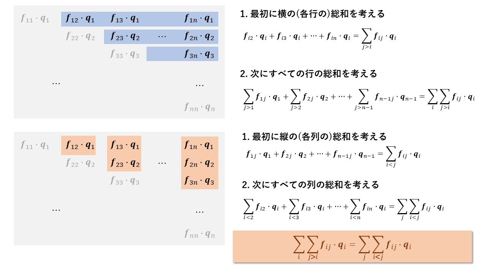

# ビリアル応力の説明
2022年8月8日時点でアンダーバー周辺のレンダリングにより、Github上で正しく表示されない現象を確認しています。VSCode等の他のMarkdownエディタで開いてみてください。

## ビリアルの定義と時間微分
まず天下りですが、以下のような物理量 $G$ を定義します。

$$
G = \sum_i \boldsymbol{p}_i \cdot \boldsymbol{q}_i
$$

ここで $\boldsymbol{p}_i$ は $i$ 番目の粒子の運動量、 $\boldsymbol{q}_i$ は $i$ 番目の粒子の位置ベクトルを指します。ここで両辺を時間微分してみます。

$$
\frac{\partial G}{\partial t} = \sum_i \frac{\partial \boldsymbol{p}_i}{\partial t} \cdot \boldsymbol{q}_i + \sum_i \boldsymbol{p}_i \cdot \frac{\partial \boldsymbol{q}_i}{\partial t} \tag{1}
$$

この式の右辺について詳しく見ていきます。

## $\sum_i \frac{\partial \boldsymbol{p}_i}{\partial t} \cdot \boldsymbol{q}_i$ について

まず右辺第1項についてはニュートンの第2法則より

$$
\sum_i \frac{\partial \boldsymbol{p}_i}{\partial t} \cdot \boldsymbol{q}_i = \sum_i m_i \frac{\partial \boldsymbol{v}_i}{\partial t} \cdot \boldsymbol{q}_i = \sum_i \boldsymbol{f}_i \cdot \boldsymbol{q}_i \tag{2}
$$

となります。ここで $m$ は粒子の質量、 $\boldsymbol{f}_i$ は粒子 $i$ に作用する力です。
次にこの $\boldsymbol{f}_i$ を内力と外力に分けていきます。内力は粒子 $j$ から粒子 $i$ に作用する力を $\boldsymbol{f}_{ij}$ とします。
また外力を $\boldsymbol{f}_i^\mathrm{ext}$ とします。すると $\boldsymbol{f}_i$ は次のように分解できます。

$$
\boldsymbol{f}_i = \sum_{j \neq i} \boldsymbol{f}_{ij} + \boldsymbol{f}_i^\mathrm{ext} \tag{3}
$$

よって式 $\mathrm{(2)}$ と $\mathrm{(3)}$ によって、

$$
\begin{aligned}
\sum_i \frac{\partial \boldsymbol{p}_i}{\partial t} \cdot \boldsymbol{q}_i &= \sum_i \left\{ \left( \sum_{j \neq i} \boldsymbol{f}_{ij}  + \boldsymbol{f}_i^\mathrm{ext} \right) \cdot \boldsymbol{q}_i \right\}  \tag{4} \\
&= \sum_i \sum_{j \neq i} \boldsymbol{f}_{ij} \cdot \boldsymbol{q}_i + \sum_i \boldsymbol{f}_i^\mathrm{ext} \cdot \boldsymbol{q}_i
\end{aligned}
$$

となります。式 $\mathrm{(4)}$ の第1項についてもう少し式変形をしていきたいと思います。簡略化のため $1 \leq i, j \leq 3$ の場合を考えます

$$
\begin{aligned}
\sum_i \sum_{j \neq i} \boldsymbol{f}_{ij} \cdot \boldsymbol{q}_i = \boldsymbol{f}_{12} \cdot \boldsymbol{q}_1 + \boldsymbol{f}_{13} \cdot \boldsymbol{q}_1 + \boldsymbol{f}_{21} \cdot \boldsymbol{q}_2 + \boldsymbol{f}_{23} \cdot \boldsymbol{q}_2 + \boldsymbol{f}_{31} \cdot \boldsymbol{q}_3 + \boldsymbol{f}_{32} \cdot \boldsymbol{q}_3 \\
\end{aligned}
$$

ここで例えば、 $\boldsymbol{f}_{12}=-\boldsymbol{f}_{21}$ であることを利用すると

$$
\begin{aligned}
\mathrm{(right \ side)} &= \left( \boldsymbol{f}_{12} \cdot \boldsymbol{q}_1 - \boldsymbol{f}_{12} \cdot \boldsymbol{q}_2 \right) + \left(\boldsymbol{f}_{13} \cdot \boldsymbol{q}_2 - \boldsymbol{f}_{13} \cdot \boldsymbol{q}_3 \right) + \left( \boldsymbol{f}_{23} \cdot \boldsymbol{q}_2 - \boldsymbol{f}_{23} \cdot \boldsymbol{q}_3 \right) \\
&= \boldsymbol{f}_{12} \cdot \left( \boldsymbol{q}_1 - \boldsymbol{q}_2 \right) + \boldsymbol{f}_{13} \cdot \left( \boldsymbol{q}_1 - \boldsymbol{q}_3 \right) + \boldsymbol{f}_{23} \cdot \left( \boldsymbol{q}_2 - \boldsymbol{q}_3 \right) \\
&= \boldsymbol{f}_{12} \cdot  \boldsymbol{q}_{12} + \boldsymbol{f}_{13} \cdot \boldsymbol{q}_{13}  + \boldsymbol{f}_{23} \cdot \boldsymbol{q}_{23} \\
&= \sum_i \sum_{j > i} \boldsymbol{f}_{ij} \cdot  \boldsymbol{q}_{ij}
\end{aligned}
$$

と整理できます。2行目から3行目への式変形では相対位置ベクトル $\boldsymbol{q}_{12} = \boldsymbol{q}_1 - \boldsymbol{q}_2$ を新しく定義しました。相対位置ベクトルと作用反作用の法則を用いることで同じ力の項がまとめることが出来ました。これと同じことが一般化した場合でも可能です。

$$
\begin{aligned}
\sum_i \sum_{j \neq i} \boldsymbol{f}_{ij} \cdot \boldsymbol{q}_i &= \sum_i \left( \sum_{j < i} \boldsymbol{f}_{ij} + \sum_{j > i} \boldsymbol{f}_{ij}\right)\cdot \boldsymbol{q}_i \\
&= \sum_i \sum_{j < i} \boldsymbol{f}_{ij} \cdot \boldsymbol{q}_i + \sum_i \sum_{j > i} \boldsymbol{f}_{ij}\ \cdot \boldsymbol{q}_i \\
&= \sum_i \sum_{j < i} \boldsymbol{f}_{ij} \cdot \boldsymbol{q}_i + \sum_j \sum_{i < j} \boldsymbol{f}_{ij}\ \cdot \boldsymbol{q}_i \\
&= \sum_i \sum_{j < i} \boldsymbol{f}_{ij} \cdot \boldsymbol{q}_i - \sum_j \sum_{i < j} \boldsymbol{f}_{ji}\ \cdot \boldsymbol{q}_i \\
&= \sum_i \sum_{j < i} \boldsymbol{f}_{ij} \cdot \boldsymbol{q}_i - \sum_i \sum_{j < i} \boldsymbol{f}_{ij}\ \cdot \boldsymbol{q}_j \\
&= \sum_i \sum_{j < i} \boldsymbol{f}_{ij} \cdot \left( \boldsymbol{q}_i -\boldsymbol{q}_j \right) \\
&= \sum_i \sum_{j < i} \boldsymbol{f}_{ij} \cdot \boldsymbol{q}_{ij} \tag{5}
\end{aligned}
$$

2行目から3行目への式変形では次の図のように内積の全要素の総和を取る際に2通りの手法があることを用いています。また3行目から4行目の式変形では作用反作用の法則、4行目から5行目の式変形では添え字の交換を行っています。
 

次に式 $\mathrm{(4)}$ の第2項について検討していきます。

$$
\begin{aligned}
\sum_i \boldsymbol{f}^\mathrm{ext}_i  \cdot \boldsymbol{q}_i &=  -\int \boldsymbol{r} \cdot (P\boldsymbol{n}) \  dA \\
&= -P \int_V \nabla \cdot \boldsymbol{r} dV \\
&= -3PV \tag{6}
\end{aligned}
$$

1行目は個々の粒子に作用する外力は、境界全域に作用する圧力で置き換えられることを利用しています。
また1行目から2行目への式変形にはガウスの発散定理を用いています。
さらに2行目から3行目への式変形には $\frac{\partial x}{\partial x} + \frac{\partial y}{\partial y} + \frac{\partial z}{\partial z} = 3$を
用いています。

(以下は上の式変形に関する疑問点です)
- $\sum_i \boldsymbol{f}^\mathrm{ext}_i  \cdot \boldsymbol{q}_i$ は粒子に作用する外力によるモーメントの3成分合計値という理解でいいのか？
- $\sum_i \boldsymbol{f}^\mathrm{ext}_i = \int P\boldsymbol{n} \  dA$ であれば納得できるのだけれど、位置座標とのドット積で成立するかどうかはパッとイメージがつかない...
  - 1行目の式変形は粒子が存在する空間としない空間に分ければ説明できる？
- 力や圧力の方向はどちらが正？

## $\sum_i \boldsymbol{p}_i \cdot \frac{\partial \boldsymbol{q}_i}{\partial t}$ について

次に右辺第2項については$\frac{\partial \boldsymbol{q}_i}{\partial t}$が速度であることから、運動量 $\boldsymbol{p}_i$ を用いて式変形をすることができて、

$$
\sum_i \boldsymbol{p}_i \cdot \frac{\partial \boldsymbol{q}_i}{\partial t} = \sum_i \frac{\| \boldsymbol{p}_i \|^2}{m_i}
$$

となります。またエネルギー等配分の法則(理想的な系の熱平衡状態において、1自由度あたりに平均で $k_BT /2$ の運動エネルギーが割り振られる)から $\| \boldsymbol{p}_i \|^2 / 2m_i = k_BT /2$が成立し

$$
\sum_i \frac{\| \boldsymbol{p}_i \|^2}{m_i} = \sum_i 3k_BT = 3Nk_BT
$$

となります。ここで $N$ は粒子数です。

## $\mathrm{(1)}$式の時間平均を取る

以上の議論$\mathrm{(5)}$式と$\mathrm{(6)}$式から$\mathrm{(1)}$式は次のように変形できました。

$$
\frac{\partial G}{\partial t} = \sum_i \sum_{j < i} \boldsymbol{f}_{ij} \cdot \boldsymbol{q}_{ij} - 3PV + 3Nk_BT \tag{7}
$$

ここでこの式全体の時間平均を取ります。ある物理量 $A$ の時間平均は次式で定義できます。

$$
\bar{A} \equiv \lim_{t \rightarrow \infty} \frac{1}{t} \int_0^t A(t) dt
$$

まず$\mathrm{(7)}$の左辺は

$$
\begin{aligned}
\overline{\frac{\partial G}{\partial t}} &= \lim_{t \rightarrow \infty} \frac{1}{t} \int_0^t \frac{\partial G}{\partial t} dt \\
&= \lim_{t \rightarrow \infty} \frac{G(t)-G(0)}{t}
\end{aligned}
$$

となり、ここで $G$という量に上限があるなら、十分に長い $t$ を取れば左辺はゼロになります。すなわち

$$
\overline{\frac{\partial G}{\partial t}} = 0
$$

です。また右辺の第1項については、総和項全体がマクロ変数であると考えられるため、時間平均 $\overline{...}$ と平衡値 $\langle ... \rangle$ が一致すると言えます。そのため$\mathrm{(7)}$式は

$$
\begin{aligned}
0 &= \left\langle \sum_i \sum_{j < i} \boldsymbol{f}_{ij} \cdot \boldsymbol{q}_{ij} \right\rangle - 3PV + 3Nk_BT \\
\therefore P &= \frac{1}{3V}\left( \left\langle \sum_i \sum_{j < i} \boldsymbol{f}_{ij} \cdot \boldsymbol{q}_{ij} \right\rangle + 3Nk_BT \right)
\end{aligned}
$$

と書き直せます。ミクロな変数のみを用いて圧力を表そうとした場合は、エネルギー等分配の法則を使って右辺第2項を元に戻すことで、次式が得られます。

$$
P = \frac{1}{3V}\left( \left\langle \sum_i \sum_{j < i} \boldsymbol{f}_{ij} \cdot \boldsymbol{q}_{ij} \right\rangle + \sum_i \frac{\| \boldsymbol{p}_i \|^2}{m_i} \right)
$$

## LAMMPS等の粒状体解析に向けた定式化

以上の式変形を応力テンソルを用いて行うことによって、個々の粒状体の位置座標と運動量から応力テンソルを求めることが出来ます。(筆者はここに至る式変形を完全に再現できていません。数式は[Lammpsの公式サイト]()から引っ張ってきたものです。)

$$
\sigma_{ij} = \frac{\sum_n^N m_n v_{n, i} v_{n, j}}{V} + \frac{\sum_n^{N^{\prime}} q_{n,i}f_{n,j}}{V}
$$

あるいは

$$
\boldsymbol{\sigma} = \frac{\sum_n^N m_n \boldsymbol{v}_m \otimes \boldsymbol{v}_m}{V} + \frac{\sum_n^{N^{\prime}} \boldsymbol{q}_n \otimes \boldsymbol{f}_n}{V}
$$

と定式化できます。LAMMPSでは第2項の相互作用ポテンシャルを計算する際に、隣接するサブ領域の情報をやり取りするためのお化け粒子も含むため $N'$ との記述になっています。(以下この式の再現を試みた試し書きです)

ビリアルテンソル $\boldsymbol{G}$ を次のように定義する。

$$
\boldsymbol{G} = \sum_n \boldsymbol{p}_n \otimes \boldsymbol{q}_n
$$

両辺の時間微分は

$$\begin{aligned}
\frac{\partial \boldsymbol{G}}{\partial t} &= \sum_n \left( \frac{\partial \boldsymbol{p}_n}{\partial t} \otimes \boldsymbol{q}_n \right) + \sum_n \left( \boldsymbol{p}_n \otimes \frac{\partial \boldsymbol{q}_n}{\partial t} \right) \\
&=  \sum_n \left( \boldsymbol{f}_n \otimes \boldsymbol{q}_n \right) + \sum_n\left(\frac{\boldsymbol{p}_n \otimes \boldsymbol{p}_n}{m_n} \right) \\
&=  \sum_n \left\{ \sum_{m<n} \left (\boldsymbol{f}_{n,m} \otimes \boldsymbol{q}_{n,m} \right) \right\} + \sum_n \left( \boldsymbol{f}_n^{ext} \otimes \boldsymbol{q}_n \right) + \sum_n\left(\frac{\boldsymbol{p}_n \otimes \boldsymbol{p}_n}{m_n} \right)
\end{aligned}
$$

となり、ここで右辺第2項は

$$
\sum_n \left( \boldsymbol{f}_n^{ext} \otimes \boldsymbol{q}_n \right) = - \boldsymbol{\sigma} V
$$