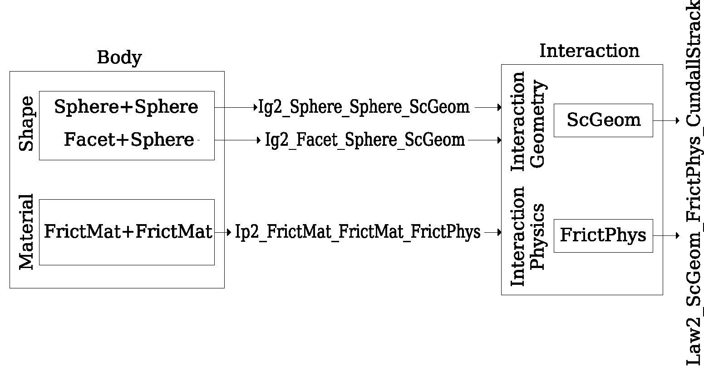

# Yade メモ・トラブルシュート

# Linux (Ubuntu) セットアップ方法

- 多分まとめて設定する方法があるはず…
- Ubuntuは日本語バージョンをインストールして、言語を英語に変更するといい
    - 日本語キーボードの設定で迷うことがない
    - もしParallels Desktopなどの仮想環境で行う場合にはこちらの設定変更方法を参考にするとよい
        - [https://devlights.hatenablog.com/entry/2020/06/09/181146](https://devlights.hatenablog.com/entry/2020/06/09/181146)
- インストールするもの
    - VScode, Chrome, Paraview
- 日本語入力の設定
    - 半角スペースと無変換/変換でIMEの切り替え
    - [https://devlights.hatenablog.com/entry/2020/06/09/181146](https://devlights.hatenablog.com/entry/2020/06/09/181146)
- 上記をインストールした後、以下のコードを実行
    
    ```bash
    sudo apt update
    sudo apt upgrade
    
    # 再起動後に以下を実行
    sudo apt install yade git libcanberra-gtk* qtwayland5
    
    # .bash_profileがなければ作る
    sudo touch ~/.bash_profile
    sudo nano ~/.bash_profile
    
    # /.bash_profile内に以下を記載
    export GTK_PATH=/usr/lib/x86_64-linux-gnu/gtk-3.0
    # ctrl+Xを2回押してターミナルに戻る
    
    # /.bash_profileを再読み込み
    source ~/.bash_profile
    
    # Documentのディレクトリに移動
    cd ~/Documents
    git clone https://github.com/masamasace/Yade-Cyclic-Constant-Volume
    ```
    
- トラブルシュート
    - `/usr/bin/python3.10: symbol lookup error: /snap/core20/current/lib/x86_64-linux-gnu/libpthread.so.0: undefined symbol: __libc_pthread_init, version GLIBC_PRIVATE`
        - `unset GTK_PATH`を実行する
            - 参考：[https://github.com/ros2/ros2/issues/1406](https://github.com/ros2/ros2/issues/1406)
    - `Gtk-Message: 08:24:46.397: Failed to load module "canberra-gtk-module”`
        - `sudo export GTK_PATH=/usr/lib/x86_64-linux-gnu/gtk-3.0`を実行する
            - 参考：[https://jp.mathworks.com/help/matlab/matlab_env/remove-canberra-gtk-module-and-pk-gtk-module-messages.html](https://jp.mathworks.com/help/matlab/matlab_env/remove-canberra-gtk-module-and-pk-gtk-module-messages.html)
- 2023/08/19
    - `apt`と`apt-get`の違い
        - [https://rs-techdev.com/archives/151](https://rs-techdev.com/archives/151)
            - aptはapt-getの持っていた設計上のミスを克服している
            - aptは依存関係にある未インストールのパッケージもインストールしてしまう
            - apt-getは上記の場合止まる
- 2023/07/03
    - Cyclic_shearの方の修正点
        - exportData関数の呼び出し条件の変更
            - 反転時の重複呼び出しの禁止
            - 特殊条件での呼び出しフラグの導入
                - 反転時、ゼロクロス時
        - せん断方向をzxからzyに変更
        - 入力エネルギー、エネルギー密度、平均有効主応力、応力の圧縮を正に、体積
        - エネルギーの単位の修正
        - VTK出力ファイルの制限
    - 方向がわからなくなった
        - 0, 1, 2がそれぞれx, y, zに対応していることは確認
        - 
- 2023/06/28
    - 杭挿入のコードを書く
    - リポジトリ内のマークダウンへ
- 2023/06/26
    - ひとまずのデータ
    - [https://xgf.nu/ZRRw](https://xgf.nu/ZRRw)
    - 柳君が回したものでエラー
        - 出力ファイルの改善
            - ファブリックテンソル
            - stage、繰り返し回数、Unbalanced Force、摩擦角、エネルギーの項のヘッダー、各項の単位、現時点での間隙比、実時間換算、
            - ひずみで終了判定
                - おそらくだけど、せん断変位が大きすぎると横の境界の幅が限りなく0に近づいてしまうのでは…
            - データ出力の頻度(Iter10と反転の時は絶対欲しい…)
            - Video
        - 
- 2023/06/22
    - 現時点での問題・課題
        1. せん断力が作用していないように見える
            - エンジンの定義で`Bo1_Sphere_Aabb(), Bo1_Facet_Aabb(), Bo1_Box_Aabb()`となっている場合と、`Bo1_Sphere_Aabb()`だけになっている場合がある。
                - 後者は例えばサンプルの`periodic_triaxial_shear.py`など
                - (解答) 使っているBodyのタイプによって入れるものを変える必要がある。
                    - 現時点でのコードだとFacetは使っていないので、その部分は消去
            - ただこれはせん断力が作用しない根本的な問題の解決にはなっていない
        2. なぜ圧密のような挙動が生じるのか
            - 詳しく見ると規定の応力を超えても戻らないようになっている
            - GoalとStressGoalの値は不変
            - `O.cell.trsf`で追ってみると`state_index`が0から1に変わると、3の状況になる。=歪が生じない緩和期間が存在する。
                - つまりUnbalanced Forceの解消によって少しずつ内部で歪が蓄積していき、境界の変位がない場合には境界での反力が落ちる傾向がある
                    - 周期境界でもこんな減少が起こるのか？という疑問はある
                - 3を解決すれば2も解決する。
        3. なんかBoundary Controllerを更新した後数秒緩和期間みたいなのが存在する
            - ひずみ一定でも応力は変化する
            - 最初のひずみ速度がすごく遅い…
            - また`state_index`が更新された際にもひずみ速度が落ちてしまう
            - 原因は以下の通り(`PeriIsoCompressor.cpp`に書かれている。)
                - ひずみ速度の計算は以下のようになっている
                    - progressが0で一つでかつ、目標値が応力のテンソル成分がある場合には、デフォルト値のヤング率とポアソン比を用いてコンプライアンスマトリクスを生成して、応力増分からひずみ増分を求める
                        - ここでxxpathを設定していない場合は応力増分は初期値は考慮されず、純粋な現時点でのprogressで決定される。
                        - xxpath=((0.00001, 1), (1, 1))を設定している場合でも、第2ステップ目に入っているため応力増分は上の場合よりも小さくなってしまう。
                    - またprogressが0よりも大きい場合は、前のステップのひずみ速度テンソルの絶対値の最大値に定数(.hppの方に0.1がベストであると書かれている)を掛けたものが、ひずみ速度テンソルの各成分の増分になる。
                        - 足されるのか減らされるのかは、現応力と目標応力の差分のsignによる
                            - 厳密には1つ前の応力も使った線形補間の傾きの符号を使っている
                            - また増分の絶対値は全てのテンソル成分について共通だが、符号は各成分ごとによって異なる
                - 要するに、以下の要素が噛み合って緩和領域が形成されている
                    - progressが0の場合
                        - そもそも応力増分がむちゃくちゃ小さいので、最初のひずみ増分が小さい値からスタートしてしまう
                            - 緩和状態の理由1
                        - またデフォルト値のヤング率とポアソン比は現時点でのマクロ的なヤング率とポアソン比ではない
                    - progressが0でない場合
                        - 基準となるstressIdealが上がってくるのが遅いため、初期応力状態が0でない状態だと、最初は増分が負になり、現応力よりもstressIdealが大きい状態になって初めて上昇に転じる。
                            - 緩和状態の理由2
                        - またある時間ステップにおける減分の最大値は、一つ前の時間ステップにおけるひずみ速度テンソルの全ての成分における絶対値の最大値に0.1を掛けたものなので、絶対にStrain Rate自体の符号が逆転することはない
                            - 応力がたとえ行き過ぎてしまっても、ひずみ速度を反転させて応力を減らそうという制御にはならない
                - 結論：O.cell.trsfに書き換えましょう。Boundary Controllerは使わないほうがいい…
        4. 一回新しくBoundary Controllerを定義すると一旦応力が開放されてしまう
            - 別のBoundary Controllerを使うか、あるいはもう一度同じBoundary Controllerを更新して見る方法でやってみるか…
            - やっぱりxxpathあたりの挙動が理解できていないのでは？
                - サンプルコードを動かしながらやる
            - おそらく実際の境界の位置がもとに戻っている？
- 2023/06/21
    - Cell周りの挙動がわかっていない感じ。
    - 現時点でのブランチは[ここ](https://github.com/masamasace/constant_pressure_yade/commit/f3cd4edad9a03d87e1d5cb868bce6cbbae26543b?diff=split)から見れる
    - 現時点での問題・疑問
        - せん断力が作用していないように見える
            - エンジンの定義で`Bo1_Sphere_Aabb(), Bo1_Facet_Aabb(), Bo1_Box_Aabb()`となっている場合と、`Bo1_Sphere_Aabb()`だけになっている場合がある。
                - 後者は例えばサンプルの`periodic_triaxial_shear.py`など
            - (解答) 使っているBodyのタイプによって入れるものを変える必要がある。
                - 現時点でのコードだとFacetは使っていないので、その部分は消去
        - なぜ圧密のような挙動が生じるのか
        - 一回新しくBoundary Controllerを定義すると一旦応力が開放されてしまう
            - 別のBoundary Controllerを使うか、あるいはもう一度同じBoundary Controllerを更新して見る方法でやってみるか…
            - やっぱりxxpathあたりの挙動が理解できていないのでは？
                - サンプルコードを動かしながらやる
    - ひとまず調べる
        - [User’s manual](https://yade-dem.org/doc/user.html)をひとしきり読む！
            - `Shape`、`Bound`、`State`、`Material`から作るのもいいけど、もう少し便利な関数を用意しているからそっちを使うと良い
                - 例えば`Sphere`、`Facet`、`Wall`など
                - `O.materials`は追加することしかできず、後から属性値を変更したりすることはできない(要確認)
                - もしMaterialに何もインスタンスがない場合、デフォルトの値が呼ばれる。
                - `O.bodies.append`を利用して、どんどん値を追加していくこともできるけど、後述する便利な関数たちを使ったほうがよい
                - 半径分布は絶対与える必要がある。
                - いくつかのアルゴリズムは境界を粒子のが並んだ状態としてみなす。これはより摩擦を少なくする
                - 密度を制御しながら生成する方法もある
                - 体積の表現方法には2つある
                    - 一つは軸方向に向いた境界領域(Axis-aligned boudning box)から定義されるもの(BREP, Boundary Representation)
                    - もう一つがCSGと呼ばれる手法
                - CSG(Constructive Solid Geometry)について
                    - まず最初に粒子を入れる形状を用意
                    - (おそらく内部的には)全体に粒子を生成した後、形状の内部だけ残すような処理をしている
                    - シンプルな形状をシミュレーションするのが得意
                - BREP
                    - CSGよりもフレキシブル、だけど厳密ではない
                    - 3次元のメッシュを読み込むことができる
                        - 読み込んだ後に、粒子生成をするためのpredicate(基礎)あるいはサーフェス作成に用いることができる
                - Predicates(基礎とか基盤、適当な翻訳が見つからない…)2つに対して、and、or、差分などの処理ができる
                    - 普通の演算子を使える(&, | , -, ^)など
                - Packing Algorithmについて
                    - 次のような手順で行われる
                        - 粒子の位置と半径を生成
                        - 粒子が指定された位置と半径に呼び出される。それぞれ粒子の呼び出した、実際のBodyオブジェクトを生成する。
                        - パッキングの関数がリストを返す。リストは`toSimulation`関数を使ってsimulationに追加できる
        - Dynamic Packing
            - `pack.randomDensePack`は 初期に緩く、オーバーラップしない粒子を生成して、もしこれ以上粒子を挿入できなくなったら、圧縮と除荷を行う。これで最終的なパッキングが与えられたpredicateを使ってクリップする
        - 一般的には、粒子の衝突において相互作用が生成される。
            - `Collider`クラスがおおよその粒子間接触を検知して、`IgeomFunctor`が正確な衝突を見つける
            - コンクリートのモデル化などでは、幾何的接触がよりも密に初期相互作用のネットワークが形成される。
            - 無次元量によって粒子の半径が”拡大”されて、相互作用半径のようなものを作る
            - 具体的な手順は以下の通り
                - おおよその接触を検知するために相互作用半径(`Bo1_Sphere_Aabb`の`aabbEnlargeFactor`)を調節
                - ジオメトリ
        - 基本的なエンジンについて
            - 一般的なDEMのシミュレーションにおいて、次のステップが必要になる
                - 前のステップにおける力のリセット：`ForceResetter`
                - 新しい衝突を見つける：`InsertionSortCollider`
                - 相互作用を計算：`InteractionLoop`
                - 力を加えて、粒子の位置をアップデートする：`NewtonIntegrator`
            
            ```
            sudo apt-get update
            sudo apt-get upgrade
            # 再起動後に以下を実行
            sudo apt-get install yade
            
            ```
            
            - このエンジンの順序は重要
                - 追加のエンジンは`InteractionLoop`の後に追加する
                    - 力を加える場合には`NewtonIntegrator`の前に
                    - 追加のエンジンがBodyの位置を使用する場合には、`NewtonIntegrator`の前にする必要がある。
                - `O.engines`は一度に全部代入される必要がある
                
                ```python
                O.engines.append(SomeEngine()) # wrong
                O.engines = O.engines + [SomeEngine()] # ok
                O.engines = O.engines[:2] + [SomeEngine()] + O.engines[2:] # ok
                ```
                
            - ファンクター(直訳すると機能するもの, 機能子とでも訳そうかな)とディスパッチャー(渡し役)をしっかり定義しよう。整合的でないとだめ。
                - [もう少し詳しく](https://yade-dem.org/doc/introduction.html#dispatchers-and-functors)
                    - `InsertionSortCollider`：ディスパッチャーの一つ
                        - 内部的には `BoundDispatcher`が使われている
                        - 全てのBodyを一つ一つ見ていって、引数として取ったファンクターを発出するイメージ
                        - ファンクターはある特定のBodyに対する境界を生み出したり更新したりする。
                            - ここでの境界(Bound)というのは、関連するBodyが占める空間の一部を囲むオブジェクトのことを指す。衝突検知を最適化するために使用する。決してシミュレーションの境界領域のことではない点に注意。(おそらくそれはpredicatesと呼ばれるもの?)
                        - このfunctorは2つあり、一つがspheresを扱うもの、もう一つがfacetsを扱うもの
                    - `Bo1`ファンクターについて
                        - BoはBoundで、Boundを作るためのfunctor
                        - `Bo1_Sphere_Aabb`であれば粒子に対応するファンクターであり、Axis-aligned bounding boxを生み出す。
                        - ほかにも`Bo1_Facet_Aabb`や `Bo1_Cylinder_Aabb`などもある
                        - `Bo1`ファンクターは単一の形状からAabbインスタンスを生み出すため1という数字がついている
                    - `InteractionLoop`：よく使われるディスパッチャーのもう一つ。内部的には`IGeomDispatcher`と`IPhysDispathcer` 、Law`Dispathcer` が使われている
                        - この`IGeomDispatcher`は `Ig2`という文字が 名前が入ったファンクターを使う
                            - ここで2というのは2つの形状(Shape)に関するオブジェクトのコンビに基づいて発出されるということからついている
                            - また`IGeom`クラスから継承されているため`Ig`がついている
                            - 発出されたファンクターは衝突の構成を決定して、もし衝突があれば相互作用に関連する`IGeom`を作成する。
                            - また実際には衝突していなくても、Aabbがオーバーラップしていることによる”衝突してるかも判定”が出れば、同じような挙動をする
                            - このFunctorによって生成されるインスタンスは`ScGeom`と呼ばれるもの
                                - `Sc`というのはsphere contactの略だけれど、SPhereだけでなく他のBodyとの接触を表したもの。
                            - `Ig2`はSphere, Wall, PFacetの3つから2つの組み合わせを取るので次のような組み合わせになる。
                        - `IPhysDispathcer` も上と同様。摩擦に関する接触モデルでどのインスタンスを使っているかで適切なやつを選ばないといけない
                            - `Ip2_FrictMat_FrictMat_FrictPhys`は例えば2つの`FrictMat`インスタンによる`FrictPhys`を生み出す。
                        - `LawDispatcher`については少し特殊。
                            - 上記の2つのDispacherに対応するファンクターを選ばないといけない
                                
                                
                                
                            - qtwayland5上の例だと`Law2_ScGeom_FrictPhys_CundallStrack`でないと行けない。他の`Law2_ScGeom_ViscElPhys_Basic`などでは行けない。
                            - この`LawDispatcher`はオリジナルの構成則がたくさんあるが、しっかり論文も発表されていて検討されているものを使う。
                                - [https://yade-dem.org/wiki/ConstitutiveLaws](https://yade-dem.org/wiki/ConstitutiveLaws)
                            - `Law2_ScGeom_MindlinPhys_Mindlin`: Hertx-Mindlin Formulationの構成則。法線方向には非線形、せん断方向には線形関係をまず仮定。最大摩擦力をモールクーロン基準によって決定。
            - 動きの拘束条件
                - `Body.dynamic`は真偽値で設定していて、Bodyが`NewtonIntegrator`の動作によって加速するかどうかを設定できる
                    - 注意したいのが、粒子に質量が設定されていない場合、無限の変位が生じてしまう
                    - またFacetsはデフォルトでFalseにしてあるが、`State.mass`で設定することによって非負の値にすることもできる。
                - `State.blockedDOFs`に関しては6自由度のうちどの方向に動けるかを設定できる
                - 例えば次のような書き方をすると、Specimenの底面の粒子の動きを拘束できる
                
                ```python
                for bin O.bodies:
                # block all particles with z coord below .5:
                	if b.state.pos[2]<.5: b.dynamic=False
                ```
                
                - ここに`Boundary Controller`も入ってくる
    - 追加
        - `GlobalStiffnessTimeStepper`について
            - 2つの接触体における固有周期のすべての組み合わせの中で、一番小さいものがOverall critical timestep, dTcr(これ以上周期を大きくしてはいけない限界タイムステップ)
                - 実際は6自由度の中での最小値を取る。
            - ただ問題なのが、接触がない場合にdTcrが無限大になってしまうこと。
            - そのためp波速度に基づくタイムステップdTcrpがdTcrに比例することを利用して、dTcrpの0.3倍(下の式とは違うけど)を用いることが多い
            - そのため`GlobalStiffnessTimeStepper`を使うと動的に時間ステップを変更することができる
        - `NewtonIntegrator`について
            - 運動方程式の積分に関するエンジン。減衰項が入るのは下記の理由から。
                - 準静的仮定において粒子の運動エネルギーは称賛していることが望ましい。ただ多くの構成則には速度依存の減衰項が入っていないので、人工的な数値減衰を入れる余地がある。
                - 基本的な方法として、現時点での加速度と粒子速度の積の方向に所定の数値減衰係数をかけた割合を現時点での粒子に対する作用力から引く
                - 上記の立式はPFCなどで用いられている方式でYadeの場合には中間ステップにおける速度を用いている
- [廃止したブランチ](https://github.com/masamasace/constant_pressure_yade/blob/update-temp/20230601_Uchi_modified.py)からのコピペ (解析の際の時間ステップ、境界制御のためのクラスについての記述が少し詳しく書いてある)
    
    ```python
    """
    以下は下のプログラムコードを作るにあたって書いた大雑把なメモ書きです。
    わからないところがあれば答えられる範囲で答えるので、なんでも聞いてください。
    https://yade-dem.org/doc/yade.wrapper.html#yade.wrapper.Peri3dController
    
    # 基本的な内容
    Yadeには境界を制御するためのクラスが用意されているようです。このクラスにはいくつか種類があるのですが、今回はPeri3dControllerというものを使いたいと思います。
    
    """
    
    from __future__ import print_function
    from yade import pack, plot
    from yade.gridpfacet import *
    import numpy as np
    
    # ターミナルの出力が詰まっていて見づらいための区切り線
    print("")
    print("-------------------------------------")
    
    frictangle = 35 / 180 * np.pi    # 35度をラジアンに変換
    density = 3700.0                 # 密度大きすぎないですか？
    young = 3e8
    iso_consolidation_stress = 100e3 # 等方圧密時の目標鉛直応力：100kPa=100×10^3Pa
    shear_stress_amplitude = 20e3    # 繰り返しせん断時の目標最大せん断応力振幅：20kPa
    shear_strain_amplitude = 0.5     # 繰り返しせん断時の目標最大せん断ひずみ振幅(無次元)
    max_strain_rate_con = 0.5        # 圧密時の最大ひずみ速度
    max_strain_rate_cyc = 0.05      # 繰り返しせん断時の最大ひずみ速度
    state_index = 0                  # 現時点での制御方法(0: 圧密、1: 繰り返しせん断(増加)、2:繰り返しせん断(減少))
    target_num_cycle = 10            # 目標の繰り返し回数
    current_num_cycle = 0            # 現時点での繰り返し回数
    nSteps_cycle = 1000           # 半周期の繰り返しでの計算ステップ数です。正直どれぐらいまで小さいすればよいのかはわかっていません。計算が破綻するようであれば、とりあえず倍々で大きくしていくことをおすすめします。
    flag_stress_threshold = True     # 繰り返しせん断時の折返しを応力で定義するか、ひずみで定義するかのフラグ。Trueが応力でFalseがひずみ
    mod = 0.1                       # 理想応力偏差からひずみ速度増分を計算する際にかかる係数。デフォルトは0.1。
    path_first_relative_value = (1 / nSteps_cycle) * 2
    
    # CohFrictMatクラスはどうやら粘着力を考慮できる材料のクラスみたいですね。ただ
    # https://yade-dem.org/doc/yade.wrapper.html#yade.wrapper.CohFrictMat
    # を見ると、normalCohesionとshearCohesionに正の値を設定しないと、粘着力は考慮しないみたいです。
    mat_sp = CohFrictMat(alphaKr=0.5,
                         alphaKtw=0.5,
                         young=young,
                         poisson=0.33,
                         frictionAngle=frictangle,
                         density=density)
    O.materials.append(mat_sp)
    
    sp = pack.randomPeriPack(radius=0.10, initSize=Vector3(6, 6, 2), memoizeDb='/tmp/packDb.sqlite')
    sp.toSimulation(color=(0, 0, 1))  # pure blue
    
    # 解析の際の時間ステップを決めるもの。本来であればすべての2粒子間接触から求まる固有周期の最小値を時間ステップとして採用するべき
    # ただ初期状態では接触点の数が0の場合もあるので、近似的に粒子のP波速度の0.1倍を使う。(Class Referenceと計算式が違う...)
    O.dt = .1 * PWaveTimeStep()
    
    # 下のコードはどのような意味がある？このコードを有効化すると粒子同士の内部摩擦角が0になってしまうけど...
    # O.materials[0].frictionAngle = 0
    
    """
    境界制御のためのクラスです。若干制御に戸惑ってメモ書きのため、詳しく書きます。
    # ひずみが目標値として設定された場合は、適切な(調節された)ひずみ速度が直接適用されます。
    # 応力が目標値として設定された場合には、ひずみ推定器が用いられます。
    ## このひずみ推定器というのは、2つ前のステップでの応力値からなるべく次のステップでの理想的な値になるべく近くなるように、決定する手法です。(将来的にこのアルゴリズムは修正される可能性があるが、現時点でも十分にロバストである)
    
    # すべてが応力で指定された場合、初期ステップで良い推定値が必要→このためにコンプライアンスマトリックスを導入する必要がある
    
    # (かなり手間取った点)インスタンス変数として理想応力(stressIdeal)が存在する
    ## このstressIdealは現応力との差の計算に使われ、ひずみ速度の載荷方向を決めるために使われる
    ## このstressIdealは"現在の初期応力に関わらず"、応力0から最終ステップ時に所定応力になるような線形補間で求められている。
    ### この点はPeriIsoCompressor.cppの389, 410行目を参照
    ## そのため圧密からせん断に移行するような場合、単にgoalとstressMaskを設定しただけではstressIdealが0から次第に上がっていくため、いつまで立っても載荷が終了しない減少に陥る
    ## このため、等方応力状態から定圧でせん断するような場合には、xxPath = ((すごく小さい0に近い少数, 1), (1, 1))、のような初期インスタンスが必要
    # ただこの"すごく小さい0に近い少数"の決め方が曲者
    ## xxPath (他のyyPathなどの考え方も同じ)はタプルで指定する。例えば((1, 3), (2, 4))で、nStepsが1000、goalの値が100kPaであれば次のような目標値を取るような行動をする
    ### nStep = 0 のとき 0kPa ← 書かれていないがこれが重要
    ### nStep = 500 (1000 * 1 / 2) のとき 75kPa (100 * 3 / 4)
    ### nStep = 1000 (1000 * 2 / 2) のとき 100kPa (100 * 4 * 4)
    ## なので((すごく小さい0に近い少数, 1), (1, 1))とすることで、最初のステップから所定の目標値を目指すように設定できる
    ## ただ小さすぎる値を入力しても良くない
    ### 理由は解明中なのでとりあえず暫定的に
    
    """
    Peri3D_iso = Peri3dController(
        
        # Goalでは応力テンソルかひずみテンソルの対角成分を含む上半分の目標数値を決めます。
        # 順番は00,11,22,12,02,01の順です。
        # まずは最初等方的に圧密をしたいので、(iso_consolidation_stress, iso_consolidation_stress, iso_consolidation_stress, 0, 0, 0)とします。
        
        goal = (-iso_consolidation_stress,
                -iso_consolidation_stress, 
                -iso_consolidation_stress,
                0, 0, 0),
        
        # 説明が少し難しいんですが、順番にします。まず0bというのはpythonでは0bのあとに続く数字は2進数だよという目印です。
        # 問題は111111の部分なんですが6桁の数字のそれぞれが上のテンソルの位置に対応します。
        # 注意点として最下位ビットから00, 11, 22, 12, 02, 01の順で並んでいるので以下のような対応関係になります。
        # stressMask = 0b    1    1    1    1    1    1
        #                   ↑01  ↑02  ↑12  ↑22  ↑11  ↑00
        # そして、それぞれの数字は0か1の値を取ります。
        # 0の場合はそのテンソルの目標値がひずみであること、1の場合は応力であることを表します。
        # なので上の例だと、すべての成分の目標値は応力であることを示します。
        stressMask = 0b111111,
        
        # 最大のひずみ速度を決めます。大きすぎると負のダイレタンシーが発生した際に応力を下げすぎてしまうので、一旦かなり小さい値にして、繰り返し載荷で発生するひずみ振幅よりも小さく(例えば1/10とか)にすればいいのではないでしょうか？
        maxStrainRate = max_strain_rate_con,
        
        doneHook = "checkState()"
    )
    
    # 繰り返しせん断時のしきい値を応力かひずみにするかで、目標となる値とstressMaskの値を決めます
    if flag_stress_threshold:
        goal_forward = (-iso_consolidation_stress,
                        -iso_consolidation_stress, 
                        -iso_consolidation_stress,
                        0, shear_stress_amplitude, 0)
        goal_backward = (-iso_consolidation_stress,
                         -iso_consolidation_stress, 
                         -iso_consolidation_stress,
                         0, -shear_stress_amplitude, 0)
        stressMask_temp = 0b111111
    else:
        goal_forward = (-iso_consolidation_stress,
                        -iso_consolidation_stress, 
                        -iso_consolidation_stress,
                        0, shear_strain_amplitude, 0)
        goal_backward = (-iso_consolidation_stress,
                         -iso_consolidation_stress, 
                         -iso_consolidation_stress,
                         0, -shear_strain_amplitude, 0)
        stressMask_temp = 0b101111
    
    # 繰り返し載荷(せん断力を増やす際)の境界制御のクラスです。
    Peri3D_cyclic_forward = Peri3dController(
        goal = goal_forward,
        stressMask = stressMask_temp,
        maxStrainRate = max_strain_rate_cyc,
        mod = mod,
        nSteps = nSteps_cycle,
        xxPath = ((0, 1), (1, 1)),
        yyPath = ((0, 1), (1, 1)),
        zzPath = ((0, 1), (1, 1)),
        # zxPath = ((0, 1), (1, 1)),
        doneHook = "checkState()"
    )
    
    # 繰り返し載荷(せん断力を減らす際)の境界制御のクラスです。
    Peri3D_cyclic_backward = Peri3dController(
        goal = goal_backward,
        stressMask = stressMask_temp,
        maxStrainRate = max_strain_rate_cyc,
        mod = mod,
        nSteps = nSteps_cycle,
        xxPath = ((path_first_relative_value, 1), (1, 1)),
        yyPath = ((path_first_relative_value, 1), (1, 1)),
        zzPath = ((path_first_relative_value, 1), (1, 1)),
        zxPath = ((path_first_relative_value, 1), (1, 1)),
        doneHook = "checkState()"
    )
    
    # エンジンと呼ばれる部分です。
    # 詳しくは割愛します。
    O.engines = [
        ForceResetter(),
        InsertionSortCollider(
            [Bo1_Sphere_Aabb(), Bo1_Facet_Aabb(), Bo1_Box_Aabb()]),
        InteractionLoop(
            # interaction loop
            [Ig2_Sphere_Sphere_ScGeom(), Ig2_Facet_Sphere_ScGeom(),
             Ig2_Box_Sphere_ScGeom()],
            [Ip2_CohFrictMat_CohFrictMat_CohFrictPhys()],
            [Law2_ScGeom6D_CohFrictPhys_CohesionMoment(
                always_use_moment_law=True), Law2_ScGeom_FrictPhys_CundallStrack()]
        ),
        Peri3D_iso,
        NewtonIntegrator(damping=0.2),
        PyRunner(iterPeriod=1, command="checkState()"),
        PyRunner(realPeriod=0.5, command="addPlotData()")
        
    ]
    
    print(O.dt)
    
    # 状態監視用の関数です
    def checkState():
        
        global flag_cyclic_forward
        global state_index, iso_consolidation_stress, shear_stress_amplitude, shear_strain_amplitude, current_num_cycle, target_num_cycle
        
        s00, s11, s22, s12, s02, s01 = O.engines[3].stress
        e00, e11, e22, e12, e02, e01 = O.engines[3].strain
        
        
                
        # 圧密時の状態チェックです
        if state_index == 0:         
            mean_principle_stress = (s00 + s11 + s22) / 3
            
            if mean_principle_stress <= -iso_consolidation_stress:
                print("Consolidation has finished! Now proceeding to cyclic loading")
                state_index = 1
            
                print(O.engines[3])
                engines_temp = list(O.engines)
                engines_temp[3] = Peri3D_cyclic_forward
                # 次のコードがないと、ひずみの値がリセットされてしまいます。圧密終了時点でのすべての歪成分が繰り返し載荷開始時に保持されるようにしています。
                engines_temp[3].strain = (e00, e11, e22, e12, e02, e01)
                O.engines = engines_temp    
                
                O.run()
        
        # 載荷終了に関する状態チェックです
        elif (current_num_cycle > target_num_cycle):
            print("Cyclic loading has just finished!")
            finish_simulation()
            
        # 繰り返し載荷(せん断応力増加)時の状態チェックです
        elif state_index == 1:
                 
            if (current_num_cycle <= target_num_cycle):            
                if flag_stress_threshold:
                    flag_reverse = (s02 > shear_stress_amplitude)
                else:
                    flag_reverse = (e02 > shear_strain_amplitude)
               
                if flag_reverse:
                    print("Current Cycle: " + str(current_num_cycle)) 
                    
                    state_index = 2
                    
                    print(O.engines[3])  
                    engines_temp = list(O.engines)
                    engines_temp[3] = Peri3D_cyclic_backward
                    engines_temp[3].strain = (e00, e11, e22, e12, e02, e01)
                    engines_temp[3].progress = 0
                    O.engines = engines_temp
                    print(O.engines[3])  
                    
                    current_num_cycle += 0.5
        
        # 繰り返し載荷(せん断応力減少)時の状態チェックです
        elif state_index == 2:
            if (current_num_cycle <= target_num_cycle):
                if flag_stress_threshold:
                    flag_reverse = (s02 < -shear_stress_amplitude)
                else:
                    flag_reverse = (e02 < -shear_strain_amplitude )
               
                if flag_reverse:
                    print("Current Cycle: " + str(current_num_cycle)) 
                    
                    state_index = 1
                    
                    print(O.engines[3])  
                    engines_temp = list(O.engines)
                    engines_temp[3] = Peri3D_cyclic_forward
                    engines_temp[3].strain = (e00, e11, e22, e12, e02, e01)
                    engines_temp[3].progress = 0
                    O.engines = engines_temp
                    print(O.engines[3])  
                    
                    current_num_cycle += 0.5       
                    
            
    # 載荷が終了した際に呼ばれる関数です。
    def finish_simulation():
        O.pause()
        
    # 図化のための関数です。
    def addPlotData():
        i = O.iter
        
        # (要修正)O.engines[3].stressを違う関数で2回呼び出しているので遅くなる可能性があります。
        s00, s11, s22, s12, s02, s01 = O.engines[3].stress / 1000
        e00, e11, e22, e12, e02, e01 = O.engines[3].strain
        gs00, gs11, gs22, gs12, gs02, gs01 = O.engines[3].stressGoal / 1000
        is00, is11, is22, is12, is02, is01 = O.engines[3].stressIdeal / 1000
        ge00, ge11, ge22, ge12, ge02, ge01 = O.engines[3].strainGoal
        
        print('s00: {: .2f}'.format(s00),
              ' s11: {: .2f}'.format(s11),
              ' s22: {: .2f}'.format(s22),
              ' s12: {: .2f}'.format(s12),
              ' s02: {: .2f}'.format(s02),
              ' s01: {: .2f}'.format(s01),
              ' e02: {: .5f}'.format(e02),
              ' nSteps: {: .5f}'.format(O.engines[3].nSteps))
        
        # print(O.engines[3].strainRate)
        # print(O.engines[3].stressIdeal)
        # print(O.engines[3].stressGoal)
            
        plot.addData(i = i,
                     s00 = s00,
                     s22 = s22,
                     s02 = s02,
                     e00 = e00,
                     e22 = e22,
                     e02 = e02)
        
    
    plot.plots = {"i": ("s00", "s22", "s02"),
                  "i ": ("e00", "e22", "e02"),
                  " e02": ("s02"),
                  " s22 ": ("s02")}
    
    plot.plot()
    ```
    
- 2023/06/14
    - Ubuntuはここからダウンロードした方がいい
        - [https://www.ubuntulinux.jp/download](https://www.ubuntulinux.jp/download)
        - 日本語版のダウンロードが可能→キーボード周りのめんどくさい設定をせずに済む
    - Samsung 980にWindowsをインストールしたまま、Minisforum UM773 Liteに装着。UbuntuのブータブルUSBを起動しようとしたが、どうしてもWindowsが起動してしまう
    - shredOSというdisk erase用の簡易OSを別のUSBにインストールして、一旦Windowsの内容を消去
        - https://github.com/PartialVolume/shredos.x86_64
        - 1TBの消去に約1時間半
    - 上の対応をしても治らず
    - 結局RufusでBootドライブの作り直し、
        - パーティションをGPTに設定することでBootドライブとして認識した
        - Secure BootをオンにすることでUbuntuのインストール画面が起動後に出てきた
    - `Yadeが見つからないよ`というエラー
        - 以下のコードを実行する
    - 
- 2023/05/17
    - [https://yade-dem.org/doc/tutorial-examples.html#periodic-triaxial-test](https://yade-dem.org/doc/tutorial-examples.html#periodic-triaxial-test)
        - ここからダウンロード
    - ただyadeのライブラリがないというエラー
        - この形でターミナルから実行しないとだめ
            
            ```bash
            ~~yade -x PYTHON_FILE_PATH~~
            yade PYTHON_FILE_PATH #こちらでよい
            ```
            
        - 違う複数のエラーが出ている
            - QTのwaylandエラー→[https://stackoverflow.com/questions/69994530/qt-qpa-plugin-could-not-find-the-qt-platform-plugin-wayland](https://stackoverflow.com/questions/69994530/qt-qpa-plugin-could-not-find-the-qt-platform-plugin-wayland)
                - `sudo apt install qtwayland5`で解決
            
            ```bash
            qt.qpa.plugin: Could not find the Qt platform plugin "wayland" in ""
            ```
            
            - QSocketNotifier: Can only be used with threads started with QThread→今のとこ無視
            - symbol lookup error: /snap/core20/current/lib/x86_64-linux-gnu/libpthread.so.0: undefined symbol: __libc_pthread_init, version GLIBC_PRIVATE
                - `unset GTK_PATH`で解決
                - https://github.com/ros2/ros2/issues/1406
            - Warning: Ignoring XDG_SESSION_TYPE=wayland on Gnome. Use QT_QPA_PLATFORM=wayland to run on Wayland anyway.
                - [https://stackoverflow.com/questions/69828508/warning-ignoring-xdg-session-type-wayland-on-gnome-use-qt-qpa-platform-wayland](https://stackoverflow.com/questions/69828508/warning-ignoring-xdg-session-type-wayland-on-gnome-use-qt-qpa-platform-wayland)
                    - これを参考にxorgに変えた
                - [https://blog.katio.net/page/c386da501d11a9735915](https://blog.katio.net/page/c386da501d11a9735915)
                - XorgやWaylandと、キーボード・ポインティングデバイスの仲介をするライブラリ・ドライバです。
            - `Failed to load module canberra-gtk-module`というエラー
                - `sudo apt-get install libcanberra-gtk-module`を実行
                - `export GTK_PATH=/usr/lib/x86_64-linux-gnu/gtk-3.0`
                - [https://www.mathworks.com/help/matlab/matlab_env/remove-canberra-gtk-module-and-pk-gtk-module-messages_ja_JP.html](https://www.mathworks.com/help/matlab/matlab_env/remove-canberra-gtk-module-and-pk-gtk-module-messages_ja_JP.html)
        - Xorgに変えたら3本指タッチが効かなくなった + 日本語入力ができなくなった
            - 日本語入力はこれで元に戻った
                - [https://oopsoop.com/japanese-localization-of-ubuntu/](https://oopsoop.com/japanese-localization-of-ubuntu/)
                - 戻ってなかった
                    - [https://qiita.com/vochicong/items/6452ac54bde56b0e0bb3](https://qiita.com/vochicong/items/6452ac54bde56b0e0bb3)
                    - これをやればできた
            - 3本指タッチはこれをやればできるはず→やっていない
            - https://github.com/bulletmark/libinput-gestures
        - Vscode コード整形
            - alt + shift + f
    - Yade内のコード解読
        - 参考にした[コード](https://yade-dem.org/doc/tutorial-examples.html#periodic-triaxial-test)
            - 
        - `O.engines`について
            - OはOmegaの略、グローバルインスタンスとして使われているOmegaクラスを表す。
            - `Entire simulation, i.e. both data and functions, are stored in a single Scene object. It is accessible through the [Omega](https://yade-dem.org/doc/yade.wrapper.html#yade.wrapper.Omega) class in python (a singleton), which is by default stored in the O global variable:`
                - [https://yade-dem.org/doc/introduction.html#data-and-functions](https://yade-dem.org/doc/introduction.html#data-and-functions)
        - YadeのシミュレーションはBody、Interaction、Forceの3つからなる
            - BodyはShape、Material、State、Boundからなる
                - もう少し些細なものもあるよ
                - Boundについては複数の接触判定の中での最初のおおよそ判定に使われる
        - 典型的なDEMの形として次のプロセスがシミュレーションでは繰り返される
            - 前ステップからBodyにかかる力をリセットする
            - 近似的な衝突検知
            - Bodyの正確な衝突を検出
                - 必要に応じて相互作用を更新
            - 相互作用を解決してボディに力を加える
            - 他の外的条件を適用
            - 運動方程式を積分して力によるBody位置の変更
        - 上のそれぞれのアクションをEngineと呼び、一連のEngineをSimulation Loopと呼ぶ
            - PeriTriaxController
            - O.cell.trsf
                - 周期空間(Periodic Space)が直方体を使って形成されている
                - YadeではCellクラスで定義されている
                - 等方的な速度勾配テンソル(回転とストレッチ)で表現されている
                - 速度勾配テンソルは時間で自動的に積分され、累積変形が変形マトリクス $F$で表現される
                - `O.cell.trsf`は現時点でのセルの変形マトリックスを表す
                - `Matrix3.Identity`は3x3の単位行列
            - PeriTriaxController.label
                - 一度定義するとPython内での識別子として使える
        - 排水繰り返し載荷はできそう
        - 問題は非排水繰り返し載荷
            - 少し調べる必要があるためサブノートに移行
                
                [DEM 非排水条件の設定法に関する簡易レビュー](./dem_constant_volume_loading_review.md)
                
            - [https://yade-dem.org/doc/yade.wrapper.html#yade.wrapper.Peri3dController](https://yade-dem.org/doc/yade.wrapper.html#yade.wrapper.Peri3dController)
                - Peri3DControllerというコントローラもある
                - ひずみあるいは応力テンソルの上三角部分を制御できるイメージ (応力とひずみのマスクあり)
            - [https://yade-dem.org/doc/yade.wrapper.html#boundarycontroller](https://yade-dem.org/doc/yade.wrapper.html#boundarycontroller)
                - Boundary Controllerのクラス図はこのようになっている
            - **Peri3dController、ThreeDTriaxialEngine、TriaxialStressControllerはひずみ速度を陽に与えることが可能**
                - [https://answers.launchpad.net/yade/+question/706553](https://answers.launchpad.net/yade/+question/706553)
                    - この質問者の人もTriaxialStressControllerを使ってる
        
        # 今後の課題
        
        - 高速化 (OpenMPとかGPU Accelerationとか)
        - データの可視化
        -